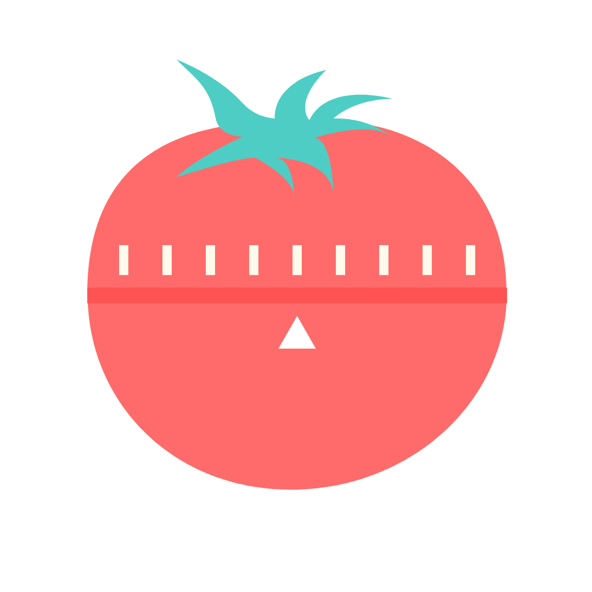

<p align="center">
  
</p>

<h1 align="center">Pomo — Pomodoro Timer</h1>

<p align="center">
  A clean, modern Pomodoro timer for iPhone and Apple Watch. Customizable sessions, Dynamic Island support, detailed statistics, and bidirectional Watch sync.
</p>

<p align="center">
  
  
  
  
</p>

## Screenshots

### iPhone

<p align="center">
  
  &nbsp;&nbsp;
  
  &nbsp;&nbsp;
  
  &nbsp;&nbsp;
  
</p>

### Apple Watch

<p align="center">
  
  &nbsp;&nbsp;
  
  &nbsp;&nbsp;
  
  &nbsp;&nbsp;
  
</p>

## Features

### Core Timer
- **Customizable Sessions** — Work (10–60 min), short break (3–15 min), long break (10–30 min)
- **Circular Progress** — Beautiful animated progress ring with time remaining
- **Automatic Flow** — Seamlessly transitions between work and break periods
- **Pause, Resume, Skip, Reset** — Full control over your sessions
- **Background Support** — Timer continues when the app is backgrounded
- **Push Notifications** — Get notified when sessions complete
- **Quick Actions** — Start work, take a break, or view stats from the home screen

### Dynamic Island & Live Activities
- **Lock Screen Widget** — See your timer on the lock screen without unlocking
- **Dynamic Island** — Compact and expanded views on supported iPhones
- **Real-Time Updates** — Timer countdown updates live

### Apple Watch
- **Independent Timer** — Start, pause, and track sessions directly on your wrist
- **Bidirectional Sync** — Settings and timer state sync between iPhone and Watch via WatchConnectivity
- **Complications** — Glanceable timer status on your watch face
- **Haptic Feedback** — Subtle taps when sessions complete

### Statistics & Tracking
- **Daily Stats** — Completed Pomodoros and total focus time
- **Weekly Charts** — Visual bar chart of your productivity over the week
- **Streak Counter** — Maintain daily productivity streaks
- **Session History** — All sessions saved automatically with SwiftData

### Customization
- **Flexible Durations** — Adjust all timer durations with sliders
- **Configurable Long Breaks** — Set sessions until long break (2–6)
- **Notification & Sound Control** — Toggle independently
- **Light & Dark Mode** — Adaptive design

## Architecture

### Built With
- **Swift 5** & **SwiftUI** — Declarative UI
- **SwiftData** — Session persistence
- **Combine** — Reactive state management
- **ActivityKit** — Dynamic Island & Live Activities
- **WatchConnectivity** — iPhone ↔ Watch sync
- **WidgetKit** — Watch complications
- **Charts** — Native chart visualization
- **AVFoundation** — Audio alerts

### Project Structure
```
Pomo/
├── Core/
│   ├── Models/           # TimerSession, TimerType
│   ├── ViewModels/       # TimerViewModel, StatsViewModel
│   ├── Services/         # DataService, NotificationService
│   └── Features/         # Feature-specific views
├── Shared/
│   ├── Extensions/       # SwiftUI extensions
│   ├── Connectivity/     # WatchConnectivity managers
│   └── Utils/            # Constants and utilities
├── Resources/            # Assets, localizations
├── PomoWatch/            # Apple Watch companion app
├── PomoWatchWidgetExtension/  # Watch complications
└── PomoWidgetExtension/  # Dynamic Island & Live Activities
```

### Pattern
- **MVVM** — Clean separation of concerns
- **Service Layer** — Dedicated services for data, notifications, audio, and connectivity
- **App Groups** — Shared state between iPhone, Watch, and widget extensions

## Getting Started

### Requirements
- **iOS 18.0+** / **watchOS 10.0+**
- **Xcode 16.0+**
- **Swift 5.0+**

### Installation
```bash
git clone https://github.com/arzaluz-chris/pomo.git
cd pomo
open Pomo.xcodeproj
```

Build and run with `Cmd + R`. For the Watch app, select the PomoWatch scheme.

### Default Configuration
| Setting | Default |
|---------|---------|
| Work session | 25 min |
| Short break | 5 min |
| Long break | 15 min |
| Sessions until long break | 4 |

All settings can be customized in the Settings tab and sync to Apple Watch.

## Localization

- **English**
- **Spanish**

Uses Xcode String Catalogs for easy extension to additional languages.

## Privacy

All data is stored locally on device. No accounts, no analytics, no third-party services. iPhone–Watch sync is local via App Groups and WatchConnectivity.

## License

This project is available under the MIT License.

## Contact

Created by [Christian Arzaluz](mailto:christian.arzaluz@gmail.com)

[Website](https://chrisarzaluz.dev/pomo/) · [Privacy Policy](https://chrisarzaluz.dev/pomo/privacy.html) · [Support](https://chrisarzaluz.dev/pomo/support.html)
